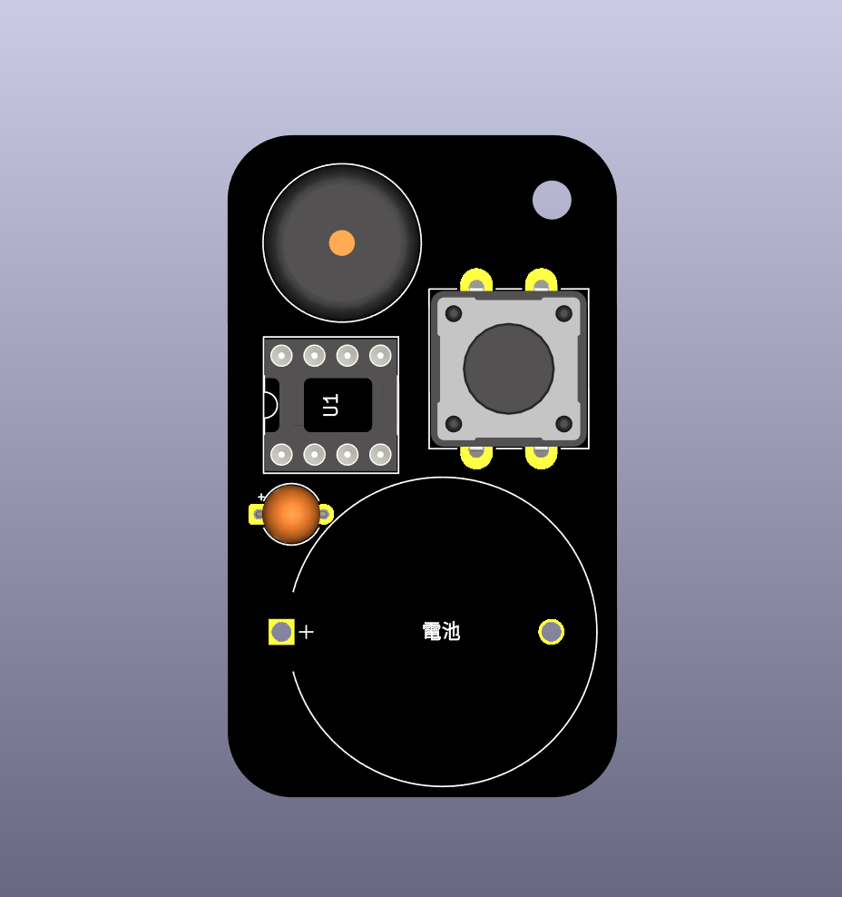
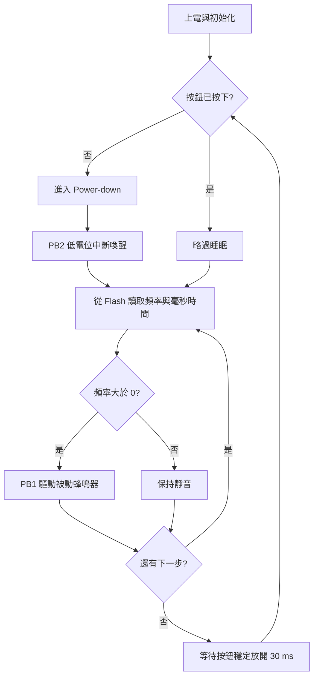

# ATtiny85 低功耗音效吊飾

這是一份可重複使用的 Arduino 公版程式：ATtiny85 平時進入 Power-down 深度睡眠，按下按鈕後由中斷喚醒，使用被動蜂鳴器播放一段自訂音效，播放完並確認按鈕放開後再回到睡眠。

初學者只需要修改兩組資料：

- `melody[]`：聲音頻率，單位是 Hz；填入 `0` 代表休止。
- `noteStepMs[]`：每一步的完整時間，單位是毫秒（ms）。

> [!IMPORTANT]
> 本專案使用被動蜂鳴器依序播放單音，不能直接播放 MP3、錄音、人聲或同時出現的和弦。



上圖是 PCB 與元件配置示意圖，用來說明蜂鳴器、ATtiny85、按鈕與電池的大致位置；它不是實體成品照片。

## 功能特色

- ATtiny85 PB2／INT0 低電位按鍵喚醒。
- 待機時使用 AVR Power-down，並停用 ADC 與類比比較器。
- 旋律資料放在 Flash（`PROGMEM`），節省 ATtiny85 的 SRAM。
- 以毫秒直接設定每個音符或休止的長度。
- 每一步使用約 90% 時間發聲、10% 時間斷音，讓音符較清楚。
- 按鈕放開需連續穩定 30 ms，降低彈跳或長按造成的重播。
- 編譯時檢查音高與時間陣列數量，避免兩組資料錯位。

## 專案內容

```text
Sound-effect-pendant/
├─ assets/
│  └─ board-preview.png      # PCB 與元件配置示意圖
├─ public_template/
│  └─ public_template.ino   # ATtiny85 公版程式
├─ .gitignore
├─ LICENSE
└─ README.md
```

## 準備材料

### 成品

| 材料 | 數量 | 說明 |
|---|---:|---|
| ATtiny85 | 1 | 本程式以 ATtiny85-20P、無 bootloader 為目標 |
| 被動蜂鳴器 | 1 | 主動蜂鳴器無法依頻率播放旋律 |
| 瞬時按鈕 | 1 | 按下時將 PB2 接到 GND |
| 0.1 µF 陶瓷電容 | 1 | 建議放在 ATtiny85 VCC 與 GND 附近作為去耦 |
| 合適電源與連接線 | 1 組 | 電壓需符合 ATtiny85 與其他元件規格 |

### 燒錄工具

| 材料 | 數量 | 說明 |
|---|---:|---|
| Arduino Uno 或 AVR 版 Nano | 1 | 作為 Arduino as ISP 燒錄器 |
| 約 10 µF 電解電容 | 1 | ArduinoISP 上傳完成後接在燒錄器 RESET 與 GND 之間 |
| 杜邦線 | 6 條以上 | 連接電源、RESET、MOSI、MISO、SCK |

## 成品接線

ATtiny85 的 Arduino 腳位編號與 DIP-8 實體腳位不同，接線時要以表格確認。

| 功能 | Arduino 腳位 | ATtiny85 實體腳位 | 接法 |
|---|---:|---:|---|
| RESET | PB5 | 1 | 保留供 ISP 燒錄使用 |
| 蜂鳴器 | PB1／`1` | 6 | 蜂鳴器另一端接 GND |
| 按鈕 | PB2／`2`／INT0 | 7 | 按鈕另一端接 GND |
| 電源 | VCC | 8 | 接供電正極 |
| 接地 | GND | 4 | 接供電負極 |

程式已使用 `INPUT_PULLUP`，所以按鈕不需要額外的下拉電阻；未按下時讀值為 `HIGH`，按下時為 `LOW`。

## 1. 安裝 Arduino IDE 與 ATTinyCore

1. 從 [Arduino 官方網站](https://www.arduino.cc/en/software)安裝 Arduino IDE。
2. 開啟 **File > Preferences**。
3. 在 **Additional Boards Manager URLs** 加入：

   ```text
   http://drazzy.com/package_drazzy.com_index.json
   ```

4. 開啟 **Tools > Board > Boards Manager**。
5. 搜尋 `ATTinyCore`，安裝 **ATTinyCore by Spence Konde**。

本專案已使用 ATTinyCore 1.5.2 編譯驗證。若使用其他版本，選單文字或編譯結果可能略有差異。

## 2. 將 Arduino Uno／Nano 設為 ISP 燒錄器

1. 先不要連接 ATtiny85。
2. 用 USB 將 Arduino Uno／Nano 接到電腦。
3. 在 Arduino IDE 開啟 **File > Examples > 11.ArduinoISP > ArduinoISP**。
4. 選擇正確的 Arduino 板型與序列埠。
5. 按一般的 **Upload**，把 `ArduinoISP` 上傳到 Uno／Nano。
6. 上傳成功後拔除 USB，再開始下面的接線。
7. 在燒錄器 Arduino 的 RESET 與 GND 之間接入約 10 µF 電解電容：正極接 RESET、負極接 GND。這顆電容用來避免燒錄期間 Uno／Nano 自動重置。

> [!CAUTION]
> 10 µF 電容是接在「作為燒錄器的 Arduino」上，不是接在 ATtiny85 的 RESET 上。需要重新上傳其他程式到 Uno／Nano 時，先移除這顆電容。

## 3. Arduino as ISP 接線

接線前先拔除 USB 與成品電池。完成全部接線並再次核對後，才把 Arduino 接回電腦。

| 訊號 | Arduino Uno／Nano | ATtiny85 訊號 | ATtiny85 實體腳位 |
|---|---:|---|---:|
| VCC | 5V | VCC | 8 |
| GND | GND | GND | 4 |
| RESET | D10 | PB5／RESET | 1 |
| MOSI | D11 | PB0／MOSI | 5 |
| MISO | D12 | PB1／MISO | 6 |
| SCK | D13 | PB2／SCK | 7 |

燒錄時注意：

- 不要同時接上電池或另一組電源。
- 不要按住成品按鈕，否則 PB2／SCK 會被接到 GND。
- PB1 同時是蜂鳴器輸出與 ISP 的 MISO；若燒錄不穩定，可先暫時斷開蜂鳴器再測試。
- 確認 ATtiny85 的凹口或圓點方向，避免將 DIP-8 腳位左右接反。

## 4. 設定 ATtiny85 板型

在 Arduino IDE 的 **Tools** 選單設定：

| 選項 | 設定值 |
|---|---|
| Board | ATtiny25/45/85 (No bootloader) |
| Chip | ATtiny85 |
| Clock Source | 8 MHz (internal) |
| Timer 1 Clock | CPU (CPU frequency) |
| LTO | Enabled |
| millis()/micros() | Enabled |
| Save EEPROM | EEPROM retained |
| B.O.D. Level | B.O.D. Disabled (saves power) |
| Programmer | Arduino as ISP |

第一次設定晶片，或日後修改 Clock／B.O.D. 選項時，執行一次 **Tools > Burn Bootloader**。這個 No bootloader 板型不會安裝一般序列 bootloader；此步驟主要是寫入時脈與 BOD 等 fuse 設定。

> [!WARNING]
> Fuse 設定錯誤可能讓晶片無法用原本方式燒錄。請先核對選項，不要選擇沒有實際連接的 external clock。

## 5. 開啟公版並編寫自己的音效

開啟 [`public_template/public_template.ino`](public_template/public_template.ino)，只修改程式中標示的區域：

```cpp
// ===== 只需要修改這一區 =====
const uint16_t melody[] PROGMEM = {
  523, 659, 784, 0
};

const uint16_t noteStepMs[] PROGMEM = {
  150, 150, 300, 50
};
// ===== 修改區結束 =====
```

兩組資料會按照相同位置配對：

| 步驟 | 1 | 2 | 3 | 4 |
|---|---:|---:|---:|---:|
| 頻率 Hz | 523 | 659 | 784 | 0 |
| 時間 ms | 150 | 150 | 300 | 50 |
| 意義 | C5 | E5 | G5 | 休止 |

`noteStepMs[]` 是每一步的完整時間。若設定為 `300`，程式會發聲約 270 ms，再保留約 30 ms 的斷音間隔；頻率為 `0` 時，整段時間都保持安靜。

### 常用音高

| 音名 | C4 | D4 | E4 | F4 | G4 | A4 | B4 | C5 | D5 | E5 | F5 | G5 | A5 | B5 | C6 |
|---|---:|---:|---:|---:|---:|---:|---:|---:|---:|---:|---:|---:|---:|---:|---:|
| 頻率 Hz | 262 | 294 | 330 | 349 | 392 | 440 | 494 | 523 | 587 | 659 | 698 | 784 | 880 | 988 | 1047 |

### 時間參考

- `50～100` ms：很短的提示音。
- `150～300` ms：一般短音。
- `400～600` ms：較長的音。
- `1000` ms：1 秒。

### 成功音效範例

```cpp
const uint16_t melody[] PROGMEM = {
  523, 659, 784, 1047
};

const uint16_t noteStepMs[] PROGMEM = {
  120, 120, 120, 450
};
```

修改規則：

1. 先選擇 4～12 步的短音效。
2. 把音名換成頻率；要停頓的位置在 `melody[]` 填入 `0`。
3. 在 `noteStepMs[]` 填入每一步的毫秒數。
4. 確認兩組陣列的項目數相同。
5. 先修音高，再修時間，最後調整整體速度。

如果兩組陣列數量不同，編譯會顯示：

```text
melody and noteStepMs must contain the same number of items.
```

## 6. 編譯與燒錄

1. 按 **Verify**，先確認程式可以編譯。
2. 再次確認板型、Chip、Clock 與 Programmer 選項。
3. 確認成品按鈕沒有被按住，且沒有接另一組電源。
4. 選擇 **Sketch > Upload Using Programmer**；不要使用一般 Upload 按鈕。
5. 看到上傳完成後，拔除 USB，再移除 ISP 接線。
6. 接回成品電源，按下按鈕試聽。
7. 每次只改一種問題，再重新編譯與燒錄。

## 程式如何運作



主要函式：

- `playSoundEffect()`：逐步讀取 Flash 中的音高與毫秒時間並播放。
- `enterDeepSleep()`：設定 INT0 後進入 Power-down，等待按鈕喚醒。
- `waitForButtonRelease()`：確認按鈕已穩定放開，避免同一次按壓重播。

## 常見問題

| 現象 | 可能原因 | 處理方式 |
|---|---|---|
| `programmer is not responding` | ISP 接線、序列埠、Programmer 選錯，或 Uno 自動重置 | 逐條核對六線、選擇 Arduino as ISP，檢查 10 µF 電容 |
| `invalid device signature` | 晶片方向、供電或 RESET/MOSI/MISO/SCK 接錯 | 拔除電源後重新核對 DIP-8 腳位 |
| Burn Bootloader 失敗 | 目標晶片時脈過慢或 fuse 與預期不同 | 先確認晶片來源與既有 fuse；不要反覆嘗試不確定的外部時脈設定 |
| 編譯出現陣列數量訊息 | `melody[]` 與 `noteStepMs[]` 長度不同 | 逐項計數，補上或移除對應資料 |
| 上傳成功但沒有聲音 | 使用主動蜂鳴器、PB1 接線錯誤或所有頻率都是 `0` | 改用被動蜂鳴器，先測試原始公版 |
| 音高或速度不對 | Clock fuse 與 IDE 的 8 MHz 設定不一致 | 重新核對設定並執行一次 Burn Bootloader |
| 一按就重複播放 | 按鈕接線或放開狀態不正確 | 確認 PB2 使用內建上拉，放開時應為 HIGH |
| 燒錄不穩定 | PB1 蜂鳴器或 PB2 按鈕影響 ISP 訊號 | 不要按住按鈕；必要時暫時斷開蜂鳴器 |

## 驗證狀態

公版程式已使用以下環境完成編譯驗證：

- Arduino CLI 1.5.0
- ATTinyCore 1.5.2
- ATtiny25/45/85 (No bootloader)
- ATtiny85、8 MHz internal、BOD disabled、LTO enabled、millis enabled

目前驗證結果為 1648 bytes Flash、22 bytes SRAM（加入編譯期檢查後仍會再次確認）。本儲存庫尚未提供燒錄、實機播放、待機電流或電池續航的驗證結果。

## 參考資料

- [ATTinyCore Installation](https://github.com/SpenceKonde/ATTinyCore/blob/v2.0.0-devThis-is-the-head-submit-PRs-against-this/Installation.md)
- [ATTinyCore Programming Guide](https://github.com/SpenceKonde/ATTinyCore/blob/v2.0.0-devThis-is-the-head-submit-PRs-against-this/avr/extras/Ref_Programming.md)
- [Arduino IDE](https://www.arduino.cc/en/software)

## 授權

程式與文件採用 [MIT License](LICENSE)，著作權人為 Hu Sheng Hong。
